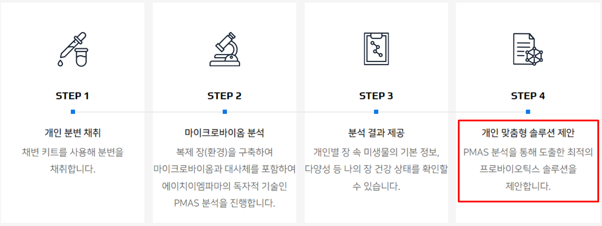

# 솔루션 배정 알고리즘 개발

암웨이 myLAB 서비스에는 개인 맞춤형 솔루션을 제안하는 단계가 포함되어 있습니다.
PMAS 분석을 통해 6개의 솔루션 중에서 어떤 제품이 고객에게 맞는 제품인지 선별하여 제안합니다.
비용 절감 및 분석 카파 증대를 위해 솔루션별로 직접 분석하지 않고 처리없이 대사체 및 NGS 분석 정보만 사용하여 솔루션을 배정하는 알고리즘을 개발하였습니다.

## 적용 방법론
- 개별 균주에 대해 각각 추천확률 생성
- 추천확률로 패턴 생성
- 패턴별로 솔루션 배정

## 결과 요약
- 균주추천모델 평균 AUC: 0.84

## 활용
- 샘플당 대사체 실험을 8번에서 2번으로 축소하여 비용 및 시간을 절감하였으며, 분석카파를 향상시켰음.
- 암웨이 마이랩 서비스에 활용되고 있음.
