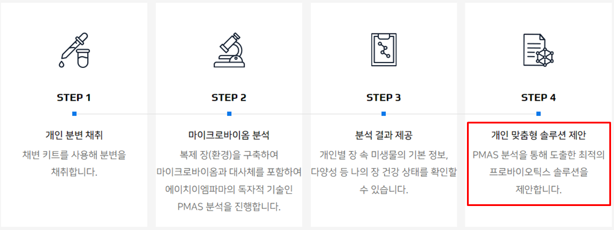
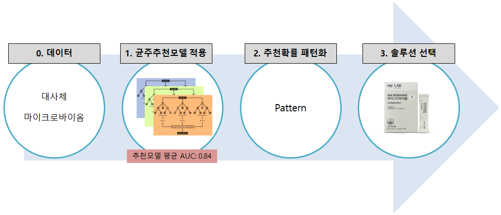

# 개인맞춤형 마이크로바이옴 솔루션 배정 알고리즘 개발

프로젝트 기간: 2021.04~2022.05 (1년 2개월)  

 22년 8월, 암웨이 한국지사에서 시작한 myLAB 서비스는 장 건강을 분석하여 개인맞춤형 마이크로바이옴 솔루션을 제공합니다. 이 서비스를 위해 월 5,000명의 서비스 제공 능력이 필요했습니다. 기존에는 샘플당 8번의 대사체 실험을 수행하였고, 최대분석능력은 월 1,920명 정도였습니다.  
 
 이를 해결하기 위해 머신러닝을 이용한 알고리즘을 개발하였습니다. 이 알고리즘은 2건의 대사체와 마이크로바이옴 데이터를 사용하여 균주별 추천 확률을 계산하고, 이를 패턴화하여 솔루션을 추천하는 방식으로 설계되었습니다.  
 
 결과적으로 샘플당 8번의 실험을 2번으로 줄일 수 있었고, 월 5,000명의 서비스 제공이 가능한 환경을 구축할 수 있었습니다. 이를 통해 myLAB 서비스를 런칭할 수 있었습니다.

## 개인맞춤형 마이크로바이옴 솔루션 서비스 프로세스

## 알고리즘 프로세스
- 개별 균주에 대해 각각 추천확률 생성
- 추천확률로 패턴 생성
- 패턴별로 솔루션 배정

## 결과 요약
- 균주추천모델 평균 AUC: 0.84

## 활용
- 암웨이 마이랩 서비스에 해당 알고리즘 활용
- 샘플당 대사체 실험을 8번에서 2번으로 축소하여 비용 및 시간 절감, 실험카파 향상

