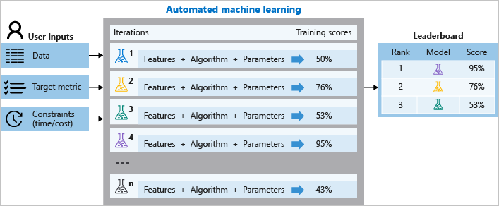
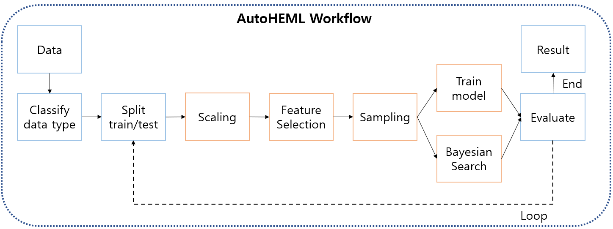

# AutoHEML 개발

프로젝트 기간: 2021.02~2021.07 (6개월)  

대사체 분석기기 교체로 인해 기존 데이터의 활용 가치가 사라졌고 새로운 데이터를 기다려야 했던 상황에서 AutoHEML 알고리즘을 개발했습니다. AutoHEML은 AutoML 기술과 HEM 사명을 결합한 합성어로, 다양한 머신러닝 모델, 하이퍼파라미터, 변수변환, 변수선택, 샘플링 방법을 자동으로 선택하여 모델을 구축하는 알고리즘입니다. 마이크로소프트의 AutoML 서비스를 벤치마킹하여 개발을 진행했고, 저는 개발 리더 역할을 수행했습니다. 공동작업을 위해 Github을 사용했고 이를 통해 알고리즘을 빠르게 구축할 수 있었습니다. 

이 알고리즘은 8만 개 이상의 조합을 탐색할 수 있으며, 시중에는 없는 특징으로 마이크로바이옴 데이터를 고려하는 차별점이 있습니다. 차후 솔루션 배정 알고리즘 개발에 적용하여 많은 시간과 비용을 절감할 수 있었습니다.

## 프로세스 도식화

### 1) Azure AutoML을 벤치마킹

### 2) AutoHEML Workflow

