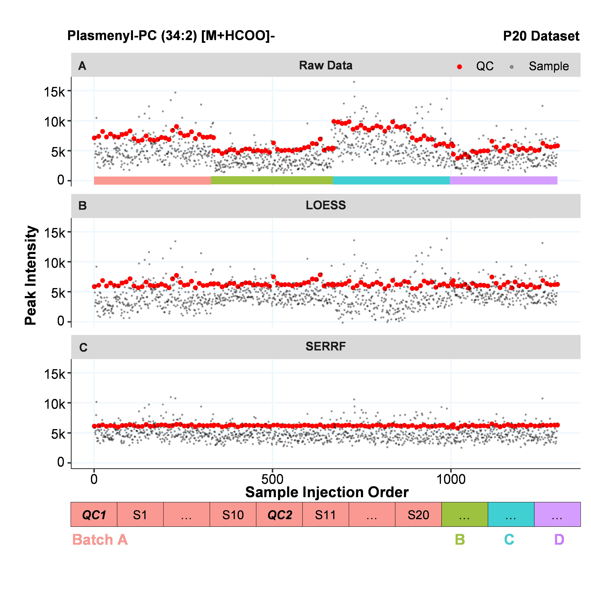

# Batch effect correction
`에이치이엠파마`

대사체 분석에는 많은 에러들이 관여하고 있습니다. 
배치 차이, 실험일, 분석기기, 실험자, 균주 lot, injection order, well position, human error 등이 포함되어 있습니다. 
순수한 생물학적 정보만을 다루기 위해 에러를 탐색하고 교정하는 업무를 하였습니다.

## Example. SERRF normalization
{: width="500", height="500"}
